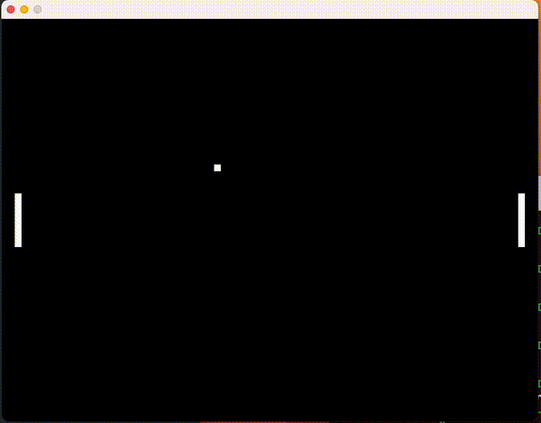

# Pong

A minimal Pong implementation in C using SDL2.

Two paddles, a ball, and a score counter — nothing more. Built as a 
focused exercise in C and SDL2, following Pikuma's game programming 
video.

## Build

Requires SDL2 installed on macOS.
```bash
make
```

## Controls

| Key | Action |
|-----|--------|
| W / S | Left paddle up / down |
| Up / Down | Right paddle up / down |

## Preview

